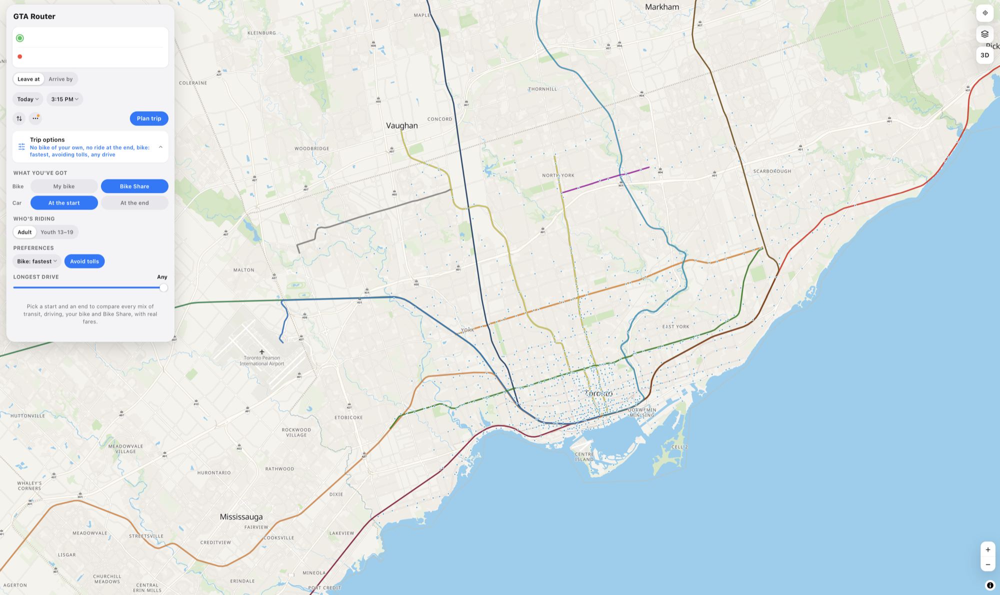

# GTA Router

A trip planner for the Greater Toronto Area that compares transit,
park-and-ride and bike-and-ride trips side by side, by travel time and by
what the trip actually costs.

https://github.com/user-attachments/assets/b8d44b34-9597-4cbe-99db-b77eb083000c



## Why I built it

My daily commute in high school was a little more than an hour each way. We
joked that my house is literally green on the map, next to forests and farms,
and while it's funny to laugh, I live so inconveniently far that transiting to
school was literally impossible. At least, that's what I thought.

A result of that devilishly long commute was a fact that shaped my life more
than almost anything else: school was just that, a place for education. It
would be a disservice to the awesome people in my life then (and now) to say I
didn't have friends, but similarly unfaithful to say I had the kind of
friendships most people my age got to have. I rarely stayed after school to
play sports or join extracurriculars, and I could not tell you about many days
where I didn't rush out of the classroom at 3:15, scared that I was gonna be
late.

I carpooled with a friend those years. Staying late meant my parents had to
drive more than an hour just to pick me up.

One morning in maybe junior year, in some delirious moment of genius, I
thought: "Hm. What if I could build a map that could illustrate the distance we
could travel with transit in a given amount of time? And if I could do that,
couldn't I also add a short drive in each trip?" Back then, I had long stopped
coding. I remember getting so frustrated debugging software whose
documentation seemed written for people who already knew the answer, I hated
asking for help on Stack Overflow, and amid a busy academic schedule, debate
tournaments across the country, and then the countless university essays, I
never really got to building it.

It was also around that time that I realized that despite York Region
Transit's questionable inadequacies, I could at least take the TTC part way
home, or even head downtown and catch a GO train. In those first few months,
3:15 stopped being a deadline; I would go to the gym with my friends, I learned
the guitar, I went to a concert, everything that a normal person my age would
have seen as, well, normal.

So this past summer, when I opened up my terminal for the first time in so
long, I remembered there was something I could build that might genuinely be
useful. That's where this planner comes from. I wanted to know: is it possible
to turn those logistically exhausting trips, the ones that opened the door to
so many stories, into something more manageable, if we used every option we
had?

If you've ever looked at the map and decided a trip was impossible, it might be
worth checking again.

## Features

- **Mixed-mode routing** across GO Transit, UP Express, TTC, YRT, MiWay,
  Brampton Transit, Durham Region Transit and the Halton local systems, as one
  network: transit only, drive to a station, bike to a station, and Bike Share
  at either end.
- **Real trip costs**: PRESTO fares with One Fare transfers, GO's
  station-to-station fare table, adult and youth pricing, fuel, parking, and
  Highway 407 ETR tolls billed by zone, direction and time of day.
- **Live data**: GTFS-Realtime delays and service alerts where agencies
  publish them, including GO trains.
- **Subway boarding tips**: each subway ride shows a small train diagram with
  the car to get on, so you step off next to the exit, or next to the stairs
  for your next line.
- **Arrive-by planning**, shareable trip links, and a drive-distance limit.
- **A custom map style** with the rapid transit lines drawn in their official
  colours, Ontario highway shields, 3D buildings, and trackpad rotation.
- **Reach map**: shades everywhere you can get to within a given time.

## How it works

The routing engine is [OpenTripPlanner 2.9](https://www.opentripplanner.org/),
built from each agency's GTFS feed and an OpenStreetMap extract of the GTA,
with a small patch that tags commuter lots OpenStreetMap is missing. The web
app is a single page (`web/index.html`) that queries OpenTripPlanner's GraphQL
API and renders the map with [MapLibre GL JS](https://maplibre.org/) on
[OpenFreeMap](https://openfreemap.org/) tiles.

OpenTripPlanner has no concept of fares for most of these agencies or of
tolls, so both are computed in the client. The Python scripts in `scripts/`
generate the data that needs: the GO fare table and the transit line shapes
from the GTFS feeds, and a 407 toll grid and rate table from OpenStreetMap
and the published rate chart.

## Getting started

Requirements: macOS with [Homebrew](https://brew.sh), Python 3, about 8 GB of
free memory and 5 GB of disk space.

```bash
git clone https://github.com/zorral0/gta-router.git
cd gta-router
cp metrolinx.env.example metrolinx.env   # then add your Metrolinx key
bash setup.sh    # installs Java and osmium, downloads the engine, feeds and map, builds the graph
bash run.sh      # starts the engine and the web app, and opens it in your browser
```

GO real-time data needs a free
[Metrolinx Open Data key](https://api.openmetrolinx.com/OpenDataAPI/Help/Registration/en).

Transit agencies replace their schedules every few weeks. To pull fresh feeds
and rebuild, stop the app and run `bash refresh.sh`.

### Tests

`tests/benchmarks.json` holds a set of GTA trips with known good answers. With
the engine running:

```bash
python3 tests/benchmark.py        # grade every trip
python3 tests/benchmark.py -v     # print each itinerary in full
```

## Project structure

```
web/                 the web app, plus the data files it loads
engine/              OpenTripPlanner configuration; downloaded feeds, map and graphs go here
scripts/             data generation (fares, tolls, transit lines, feed patches)
tests/               routing benchmark
data/                OpenStreetMap patch for missing park-and-ride lots
docs/                screenshot
setup.sh, run.sh, refresh.sh
```

## Known limitations

- Park-and-ride options depend on lots being tagged in OpenStreetMap.
  `data/parking-patch.osc` fills in the ones found missing so far.
- Fares for YRT, DRT, Brampton and UP Express are modelled from published
  PRESTO rates and have not been checked against real trips.
- The Reach map runs on a separate OpenTripPlanner 2.5 instance. To enable
  it, save the OpenTripPlanner 2.5 jar as `engine/otp25.jar` and run
  `bash refresh.sh`. The rest of the app works without it.
- Search uses the public Photon geocoder, so it needs an internet
  connection. Routing itself runs locally.

## Data and credits

- Schedules: GO Transit and UP Express (Metrolinx), TTC (City of Toronto Open
  Data), York Region Transit, MiWay, Brampton Transit, Durham Region Transit,
  Oakville Transit, Burlington Transit and Milton Transit open data.
- Map data © [OpenStreetMap](https://www.openstreetmap.org/copyright)
  contributors, available under the ODbL. Tiles by OpenFreeMap.
- Toll rates from the 407 ETR published rate chart.
- Subway boarding positions (`web/subway-boarding.json`) are transcribed from
  Sean Lerner's [TTC Subway Rider Efficiency Guide](https://www.ttc-rider.ca/)
  (2005) and shared under the guide's license,
  [CC BY-NC-SA 2.0](https://creativecommons.org/licenses/by-nc-sa/2.0/).
  Stations renovated since 2005 may be off by a car.
- [MapLibre GL JS](https://github.com/maplibre/maplibre-gl-js) is included
  under its BSD 3-Clause license.

This project is not affiliated with any transit agency, 407 ETR or Apple.

## License

[MIT](LICENSE), except `web/subway-boarding.json`, which is under
[CC BY-NC-SA 2.0](https://creativecommons.org/licenses/by-nc-sa/2.0/) (see
Data and credits).
